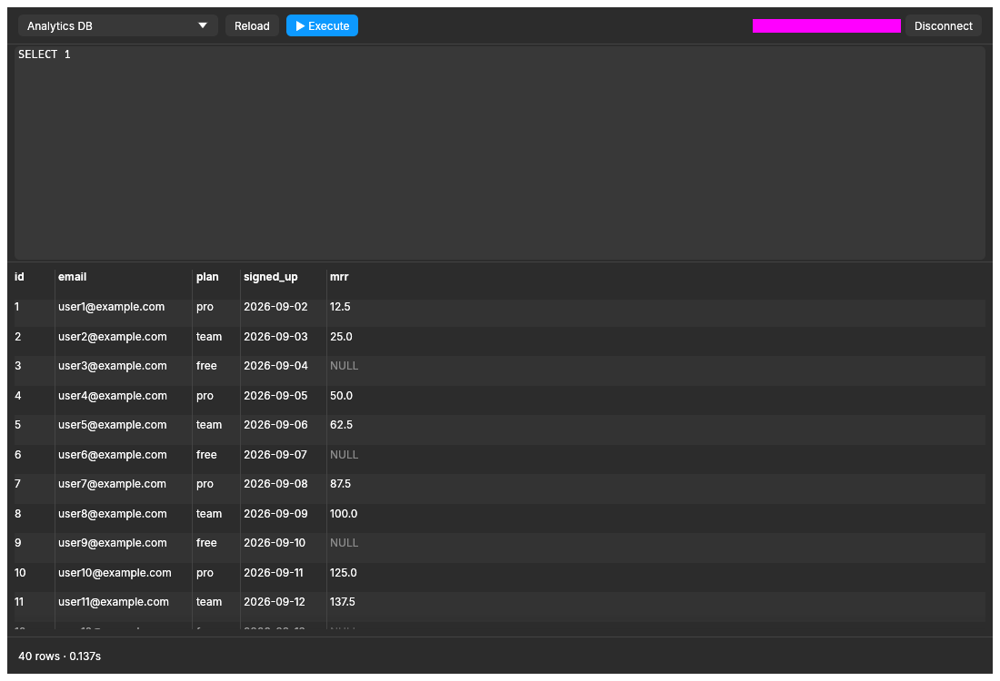

# Redash Desktop

A native desktop client for [Redash](https://redash.io), written in Rust with
[egui](https://github.com/emilk/egui). Write SQL against your Redash data sources,
run it, and browse, copy or export the results without opening a browser.



## Features

- **SQL editor** with syntax highlighting, line numbers, schema-aware autocompletion
  (tables, columns, aliases, `schema.` prefixes) and comment toggling.
- **Run queries** on any data source your Redash user can access. Long-running queries
  are polled in the background, so the UI stays responsive.
- **Results table** with pagination, row count and run time.
- **Export**: copy the current page as a Markdown table, or save every row as CSV.
- **Variables**: use `{{ name }}` in SQL. A variable is either a fixed value or the
  result of another query, whose first column becomes a list of SQL literals
  (handy for `IN (...)`).
- **Execution history**: the last 20 runs, each with its SQL, data source and
  variables. Click one to restore it.
- **Schema browser**: tables, columns and types of the selected data source, with a
  filter and a Refresh button.
- Light and dark themes that follow the OS.

## Install

Download `Redash.dmg` or `Redash.zip` from the
[Releases](../../releases) page. It is a universal build for Apple Silicon and Intel Macs
(macOS 11+).

The app is ad-hoc signed, not notarized, so macOS blocks the first launch. To open it
anyway, right-click the app and choose **Open**, or allow it under
**System Settings > Privacy & Security**.

To build it yourself, see [Development](#development).

## Getting started

1. In Redash, open your profile page and copy your **API key**. It has to be your
   user API key: query API keys can't run ad-hoc SQL.
2. Launch the app and enter your Redash URL (e.g. `https://redash.example.com`) and
   the API key.
3. Pick a data source, write a query and press **Execute**.

Settings, variables and history are stored in
`~/Library/Application Support/redash-desktop/` (`config.json`, `variables.json`,
`history.json`). The API key is stored there in plain text.

### Keyboard shortcuts

| Shortcut | Action |
|----------|--------|
| `Cmd/Ctrl + Enter` | Execute the query |
| `Cmd/Ctrl + /` | Comment or uncomment the selected lines |
| `Ctrl + Space` | Open autocompletion |
| `↑` / `↓`, `Enter` / `Tab`, `Esc` | Navigate, accept or close suggestions |

## Development

Rust is pinned in `rust-toolchain.toml`; [rustup](https://rustup.rs) installs the right
version automatically.

```sh
cargo run                    # run the app with your saved settings
cargo run -- --mock          # run against a built-in fake Redash, no server or key needed
cargo test                   # unit tests, headless UI tests and screenshot comparisons
cargo clippy --all-targets -- -D warnings
cargo fmt
```

UI tests compare screenshots against `tests/snapshots/*.png`. After an intended visual
change, check the new images and accept them with:

```sh
UPDATE_SNAPSHOTS=1 cargo test
```

### Packaging (macOS)

```sh
./scripts/bundle-macos.sh    # universal Redash.app, zip and dmg in target/dist/
./scripts/render-icon.sh     # re-render assets/icon.png from assets/icon.svg (needs rsvg-convert)
```

CI runs formatting, lint and tests on every push and pull request, and builds the app on
pushes to `main`. Pushing a tag `vX.Y.Z` that matches the version in `Cargo.toml`
publishes a GitHub Release with the build attached.

### Architecture

The app uses a one-way data flow: the UI emits an `Event`, `AppState::update` (pure
logic, no I/O) returns `Effect`s, and the runtime performs them (HTTP, files, clipboard)
and feeds the results back as events. See [AGENTS.md](AGENTS.md) for a file-by-file map,
the Redash API endpoints used, and project conventions.

## Third-party licenses

Inter font: SIL Open Font License, see `assets/fonts/Inter-LICENSE.txt`.
